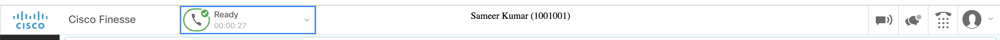
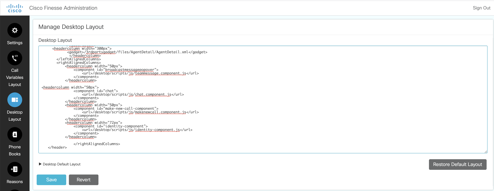

# AgentDetailGadget
Post 12.0 release of UCCX and standalone Finesse there is missing functionality on Finesse where Agent Name and Extension are not visible in the top header as previous releases.

This project provides sample code for a Finesse gadget that provides this functionality for CCX and standalone Finesse.

This gadget and code is to be used with Cisco Finesse 12.0 , a next-generation agent desktop.

The URL used is: /3rdpartygadget/files/AgentDetail/AgentDetail.xml inside headerColumn section of Desktop Layout as given below.

## Additional Info

#### Finesse REST API
Documentation for the Finesse REST API can be found in the [Finesse Developer Guide](https://developer.cisco.com/docs/finesse/#!rest-api-dev-guide).

##### Finesse JavaScript Library
Documentation for the Finesse JavaScript library can be found on [DevNet](https://developer.cisco.com/docs/finesse/#!javascript-library).
